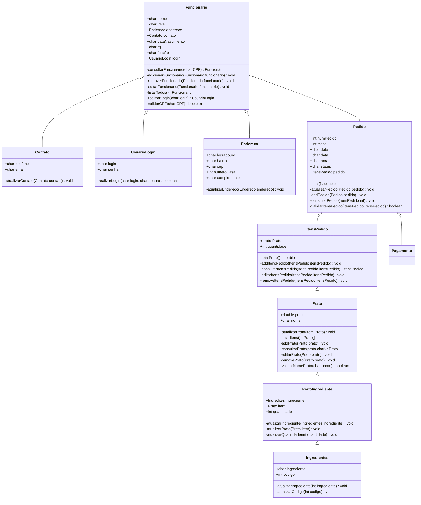
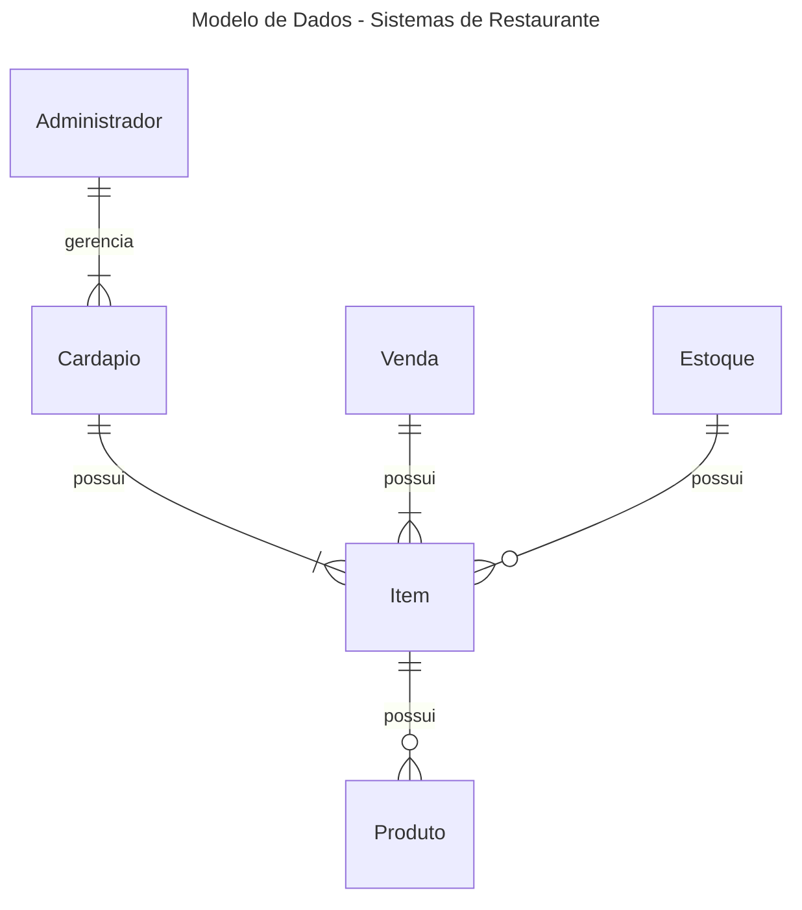

# Documento de Modelos

Neste documento temos o modelo Conceitual (UML) ou de Dados (Entidade-Relacionamento). Temos também a descrição das entidades e o dicionário de dados.

Para a modelagem pode se usar o Astah UML ou o BrModelo. Uma ferramenta interessante para modelos UML é a [YUML](http://yuml.me), no link temos um exemplo de [Modelo UML com YUML](yuml/monitoria-yuml.md). Atualmente é possível usar a ferramenta **Mermaid** segundo o blog do GitHub [Include diagrams in your Markdown files with Mermaid](https://github.blog/2022-02-14-include-diagrams-markdown-files-mermaid/). A documentação do **Mermaid** pode ser encontrada em [Mermaid in GitHub](https://mermaid-js.github.io/mermaid).

## Modelo Conceitual

### Diagrama de Classes usando Mermaid

### Descrição das Entidades

Descrição sucinta das entidades presentes no sistema.

| Entidade         | Descrição                                                                            |
| ---------------- | ------------------------------------------------------------------------------------ |
| Funcionario      | Entidade abstrata para representar informações gerais dos funcionarios.              |
| Contato          | Entidade que representa um Contato dos funcionários.                                 |
| UsuarioLogin     | Entidade que representa informações de login do usuário.                             |
| Endereco         | Entidade que representa o endereco dos funcionarios.                                 |
| Pedido           | Entidade que representa o pedido feito pelo cliente para ser enviado para a cozinha. |
| ItensPedido      | Entidade que representa os itens adicionado ao pedido.                               |
| Prato            | Entidade que representa a definição e o valor de um prato.                           |
| PratoIngrediente | Entidade que representa a definição e descrição de um prato.                         |
| Ingrediente      | Entidade que representa os ingredientes de cada prato.                               |

## Modelo de Dados (Entidade-Relacionamento)

Para criar modelos ER é possível usar o BrModelo e gerar uma imagem. Contudo, atualmente é possível criar modelos ER usando a ferramenta **Mermaid**, escrevendo o modelo diretamente em markdown. Acesse a documentação para escrever modelos [ER Diagram Mermaid](https://mermaid-js.github.io/mermaid/#/entityRelationshipDiagram).

## Dicionário de Dados

### Funcionário

| Tabela    | Funcionário                                |
| --------- | ------------------------------------------ |
| Descrição | Armazena as informações de um funcionário. |

| Nome           | Descrição                           | Tipo de Dado | Tamanho | Restrições de Domínio |
| -------------- | ----------------------------------- | ------------ | ------- | --------------------- |
| nome           | Nome do funcionário                 | VARCHAR      | 200     | Not Null              |
| CPF            | Número de CPF do funcionário        | VARCHAR      | 11      | Unique / Not Null     |
| endereco       | Endereço do funcionário             | Endereco     | ---     | ---                   |
| contato        | Contato do funcionário              | Contato      | ---     | Not Null              |
| dataNascimento | data de nascimento do funcionário   | DATE         | ---     | Not Null              |
| rg             | Número de RG do funcionário         | VARCHAR      | 15      | PK/Identity           |
| função         | URL para o site do laboratório      | VARCHAR      | 150     | Not Null              |
| login          | Informações de login do funcionário | UsuarioLogin | ---     | FK / Not Null         |

### Contato

| Tabela    | Contato                         |
| --------- | ------------------------------- |
| Descrição | Armazena informações de contato |

| Nome     | Descrição                         | Tipo de Dado | Tamanho | Restrições de Domínio |
| -------- | --------------------------------- | ------------ | ------- | --------------------- |
| telefone | Número de telefone do funcionário | VARCHAR      | 15      | Not Null              |
| email    | E-mail oficial do funcionário     | VARCHAR      | 200     | ---                   |

### Usuário Login

| Tabela    | UsuarioLogin                             |
| --------- | ---------------------------------------- |
| Descrição | Armazena informações de login do usuário |

| Nome  | Descrição                      | Tipo de Dado | Tamanho | Restrições de Domínio |
| ----- | ------------------------------ | ------------ | ------- | --------------------- |
| login | Informação de login do usuário | VARCHAR      | 30      | Not Null              |
| senha | Informação de senha do usuário | VARCHAR      | 12      | Not Null              |

### Endereço

| Tabela    | Endereco                                        |
| --------- | ----------------------------------------------- |
| Descrição | Armazena informações de endereço do funcionário |

| Nome        | Descrição                                                       | Tipo de Dado | Tamanho | Restrições de Domínio |
| ----------- | --------------------------------------------------------------- | ------------ | ------- | --------------------- |
| logradouro  | Armazena o nome da rua onde o funcionário reside                | VARCHAR      | 30      | ---                   |
| bairro      | Armazena o nome do bairro onde o funcionário reside             | VARCHAR      | 30      | ---                   |
| cep         | Representa o Código de Enderaçamento Postal                     | VARCHAR      | 12      | ---                   |
| numeroCasa  | Representa o número da casa onde o funcionário reside           | INT          | ---     | ---                   |
| complemento | Armazena informação adicional do endereço. Exemplo: Apartamento | VARCHAR      | 30      | ---                   |

### Pedido

| Tabela    | Pedido                                    |
| --------- | ----------------------------------------- |
| Descrição | Armazena informações do pedido do cliente |

| Nome        | Descrição                                          | Tipo de Dado | Tamanho | Restrições de Domínio |
| ----------- | -------------------------------------------------- | ------------ | ------- | --------------------- |
| numPedido   | Representa o identificador do pedido               | INT          | ---     | PK/Identify           |
| mesa        | Representa o número da mesa onde o cliente sentará | INT          | ---     | ---                   |
| data        | Armazena a data que foi feito o pedido             | DATE         | ---     | Not Null              |
| hora        | Representa a hora que foi feito o pedido           | DATE         | ---     | Not Null              |
| status      | Representa o andamento da produção do pedido       | VARCHAR      | 30      | Not Null              |
| itensPedido | Armazena os itens que estão no pedido              | ItensPedido  | ---     | Not Null              |

### Itens Pedido

| Tabela    | ItensPedido                              |
| --------- | ---------------------------------------- |
| Descrição | Armazena informações dos itens do pedido |

| Nome       | Descrição                                      | Tipo de Dado | Tamanho | Restrições de Domínio |
| ---------- | ---------------------------------------------- | ------------ | ------- | --------------------- |
| prato      | Representa um Prato                            | Prato        | ---     | Not Null              |
| quantidade | Representa a quantidade solicitada de tal item | INT          | ---     | ---                   |

### Prato

| Tabela    | Prato                           |
| --------- | ------------------------------- |
| Descrição | Armazena informações dos pratos |

| Nome  | Descrição                   | Tipo de Dado | Tamanho | Restrições de Domínio |
| ----- | --------------------------- | ------------ | ------- | --------------------- |
| preco | Representa o preço do prato | DOUBLE       | ---     | Not Null              |
| nome  | Representa o nome do prato  | VARCHAR      | 30      | Not Null              |

### Prato

| Tabela    | Prato                           |
| --------- | ------------------------------- |
| Descrição | Armazena informações dos pratos |

| Nome  | Descrição                   | Tipo de Dado | Tamanho | Restrições de Domínio |
| ----- | --------------------------- | ------------ | ------- | --------------------- |
| preco | Representa o preço do prato | DOUBLE       | ---     | Not Null              |
| nome  | Representa o nome do prato  | VARCHAR      | 30      | Not Null              |

### PratoIngrediente

| Tabela    | PratoIngrediente                                   |
| --------- | -------------------------------------------------- |
| Descrição | Representa uma relação entre pratos e ingredientes |

| Nome        | Descrição                              | Tipo de Dado | Tamanho | Restrições de Domínio |
| ----------- | -------------------------------------- | ------------ | ------- | --------------------- |
| ingrediente | Representa os ingredientes de um prato | Ingrediente  | ---     | Not Null              |
| prato       | Representa um prato                    | Prato        | ---     | Not Null              |
| quantidade  | Representa uma quantidade              | INT          | ---     | Not Null              |

### Ingrediente

| Tabela    | PratoIngrediente                                   |
| --------- | -------------------------------------------------- |
| Descrição | Representa uma relação entre pratos e ingredientes |

| Nome        | Descrição                                 | Tipo de Dado | Tamanho | Restrições de Domínio |
| ----------- | ----------------------------------------- | ------------ | ------- | --------------------- |
| ingrediente | Representa o nome do ingrediente          | Ingrediente  | ---     | Not Null              |
| codigo      | Representa o identificador do ingrediente | INT          | ---     | PK/Identify           |
